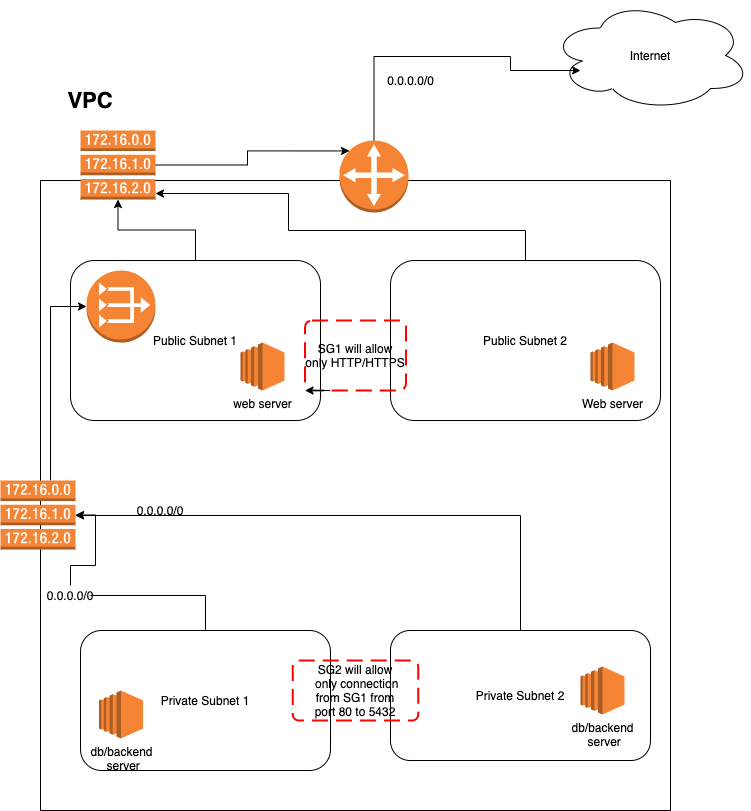

## Devops Assignment

* **Part 1:**
  1. Write an ansible playbook for installing nginx, docker, logrotate. Ensure nginx container is running on port 8080 on host and log rotation is cleaning the logs of stdout of nginx container once it reaches 100mb. (Separate roles should be created for the tasks mentioned inline) 
  2. Create a Dockerfile and docker-compose to run a 3 Tier application with backend api(node, python or any sample backend   application), database and a nginx server. Mount volumes for persistent data for database Server.
     1. Configure nginx to enable https
     2. Redirect http to https
     3. Create a self signed certificate - document how to do it.
     4. Whitelist Ip’s
     5. Any other important configurations
  3. Setup a python script that connects to remote servers over ssh and does the following:
      1. Accept commands to be executed on all the remote machines at once
      2. Wait for the execution to be completed on all the remote machines. Accept next input only once the previous execution is completed on all the machines (failed/successful)


* **Part 2:**
  1. Create a Two tier application infrastructure any cloud provider (Preferably in AWS) using Terraform, components that should be included are mentioned below  
     1. VPC 
     2. Security Group
     3. Subnet (Public and Private)
     4. NAT (Instance or service)
     5. EC2 instance 
    Terraform should use modules for reusability
  
  2. Shell script to take third most CPU & Memory consuming process, this should output to output file with the following properties
     1. Process Name 
     2. % CPU  used 
     3. % Memory used  
     4. PORT 
     5. PID
  
  3. Write a kubernetes (preferably helm) template that deploys nginx with custom configuration and exposes services as NodePort


Mandatory to choose one of the two parts and at least 2 out of 3 questions to be attempted.

(Note: Please ask the candidate to write a small description of all the attempted questions, and the reason for the solution)


### Setup Instruction

#### Part 2 
**Question 1**
please go inside `part-2/Q1` folder
1. Execute this in your terminal - 
   ```bash
   export TF_VAR_ACCESS_KEY="<Provide access key>" && export TF_VAR_SECRET_KEY="<Provide secret key>"
   ```
2. There is a run script which have 3 commands avaliable - 
   1. `run.sh plan` - will show you teraform plan
   2. `run.sh apply` - will apply teraform configurations and spin up aws resources
   3. `run.sh plan` - will destroy aws resources
   
   * *Spin up of ec2 instance code is not there due to time crunch, will add later*
   <br> **Architecture -**
   


**Question 2**
   please go inside `part-2/Q2` folder
   1. To get 3rd highest CPU consuming process -
      ```bash
      Nth_highest=3 SORT_BY=cpu ./process.sh process_details
      ```
   2. To get 3rd highest Memory consuming process -
      ```bash
      Nth_highest=3 SORT_BY=mem ./process.sh process_details
      ```

**Question 3**
   please go inside `part-2/Q3` folder
   1. Make sure you are logged into a k8s cluster. Then execute - 
      ```bash
       helm install nginx ./helm-charts --wait  -f ./helm-charts/values-env.yaml
      ```

      it will spin up a nginx deployment and get the nginx configuration from helm-charts/conf folder as a configmap and will mount it inside nginx pod